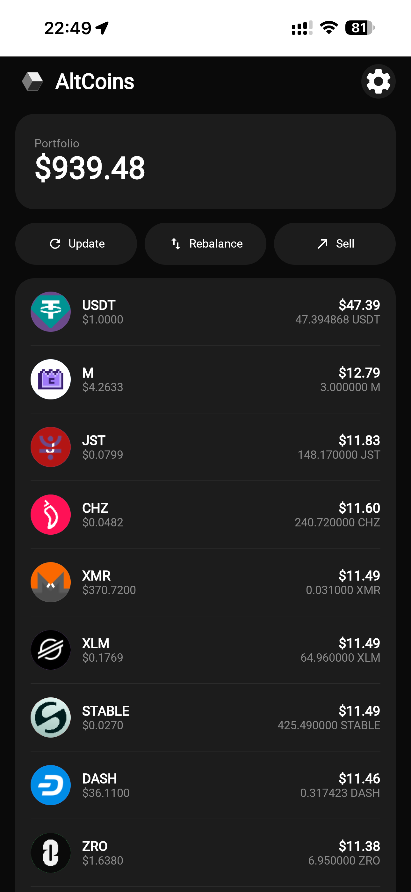

# AltCoins

Kotlin Multiplatform приложение для управления крипто-портфелем на бирже MEXC. Показывает позиции в реальном времени, ребалансирует между альткоинами и выставляет ордера на продажу — всё с одного экрана.

## Основная цель
Ребалансировка портфеля, чтобы доля монет была одинакова

## Что умеет

- **Портфель** — общая стоимость и список монет с текущими ценами и количеством
- **Обновить** — обновить текущий баланс портфеля на бирже MEXC
- **Ребаланс** — приложение запрашивает с сайта CoinMarketCap актуальный список ТОП100 монет по капитализации. Затем запрашивает актуальную информацию о портфеле с биржи MEXC. Продает монеты, которые уже не входят в ТОП100. Докупает монеты, которые попали в ТОП100, но еще нет в портфеле. Делает ребалансировку имеющихся монет (тех, что много - продает, тех, что мало - докупает), чтобы каждой было в одинаковом объеме, например, по 1% каждой монеты.
- **Продать** — выставляет рыночные ордера на продажу. Например, пользователь захотел продать на 200 USD. И в портфеле 100 монет. Тогда выставятся 100 рыночных ордеров на продажу каждой монеты на 2 USD.

## Технологии

| Слой | Технология |
|---|---|
| UI | Compose Multiplatform 1.8.0 |
| Архитектура | MVI (Store / Reducer / ScreenModel) |
| DI | Koin 4.0.4 |
| База данных | Room KMP 2.8.4 |
| Сеть | Ktor 3.1.1 |
| Подпись запросов | HMAC-SHA256 (javax.crypto на Android, CryptoKit на iOS) |
| Загрузка картинок | Coil 3.1.0 |
| Платформы | Android (min SDK 26), iOS |

## Структура проекта

```
├── shared/                  # KMP-модуль — вся бизнес-логика
│   └── src/commonMain/
│       ├── ui/
│       │   ├── screen/portfolio/    # Экран портфеля (MVI)
│       │   ├── screen/settings/     # Экран настроек (MVI)
│       │   ├── navigation/          # Стековый навигатор
│       │   └── theme/               # Цвета, типографика
│       ├── domain/
│       │   ├── model/               # CoinData, PortfolioData, SettingsData
│       │   ├── repository/          # Интерфейсы репозиториев
│       │   └── usecase/             # GetPortfolio, UpdatePortfolio, Rebalancer, Sell, …
│       └── data/
│           ├── db/                  # Room база данных + DAO
│           ├── network/             # Ktor-клиенты для CMC и MEXC API
│           └── repository/          # Реализации репозиториев
├── androidApp/              # Android-оболочка
└── iosApp/                  # SwiftUI-оболочка
```

## Запуск

1. Открыть в Android Studio Meerkat или новее (с плагином KMP).
2. Запустить на Android или iOS.
3. Перейти в **Настройки** и ввести API-ключ и секрет MEXC, а также API-ключ CoinMarketCap.
4. Ключи хранятся в EncryptedSharedPreferences (Android) / Keychain (iOS) — никогда в открытом виде.

## Подпись запросов

Каждый вызов MEXC API подписывается HMAC-SHA256 по строке запроса. Логика подписи скрыта за `expect/actual`-декларацией — каждая платформа использует свою нативную крипто-библиотеку без сторонних зависимостей.

## Скриншот


